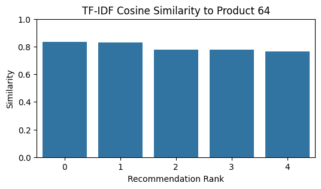
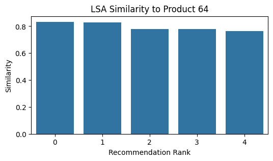
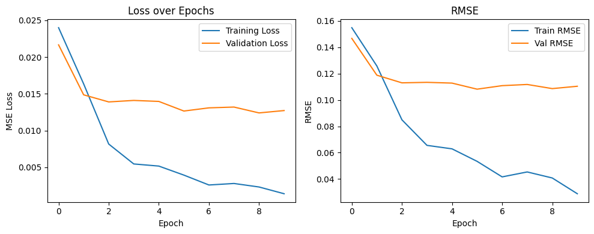
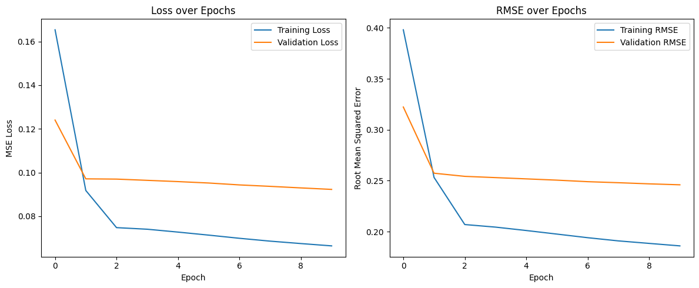

# **Laporan Proyek Machine Learning Terapan Recommendation System - Wiefran Varenzo**

## **Project Overview**


Industri fesyen global merupakan salah satu sektor dengan tingkat kompetisi yang sangat tinggi dan perkembangan yang sangat pesat. Dalam era digital saat ini, toko retail fashion dan platform e-commerce menghadapi tantangan untuk memberikan pengalaman belanja yang personal dan relevan bagi konsumen. Salah satu solusi yang terbukti efektif dalam menjawab tantangan tersebut adalah implementasi sistem rekomendasi (*recommender system*), yang secara otomatis menyarankan produk atau layanan berdasarkan preferensi dan perilaku pengguna.

Sistem rekomendasi memainkan peran penting dalam meningkatkan pengalaman pengguna sekaligus memperkuat loyalitas pelanggan serta memperbesar nilai transaksi. Dalam sebuah analisis klasik mengenai agen rekomendasi e-commerce yang ditulis oleh **Schafer, Konstan, dan Riedl (2001)** berjudul **[*E-Commerce Recommendation Agents*](https://link.springer.com/article/10.1023/A:1009804230409)**, telah lama disorot bagaimana sistem ini secara efektif dapat meningkatkan penjualan melalui *cross-selling* dan *up-selling*, membantu pengguna menemukan produk yang relevan di tengah banyaknya pilihan, yang pada akhirnya meningkatkan konversi dan loyalitas pelanggan. Studi tersebut juga menggarisbawahi bagaimana personalisasi yang didorong oleh agen rekomendasi menjadi strategi kunci untuk meningkatkan pengalaman pengguna dan mencapai keunggulan kompetitif dalam pasar digital.

Selain itu, **Ricci, Rokach, dan Shapira (2015)** dalam buku mereka yang berjudul **[*Recommender Systems Handbook*](https://doi.org/10.1007/978-1-4899-7637-6)** menjelaskan bahwa sistem rekomendasi telah berkembang menjadi bagian integral dari banyak platform digital, termasuk industri retail fashion, karena kemampuannya dalam membantu pengguna menavigasi pilihan produk yang sangat luas dan beragam secara lebih efisien. Mereka juga menekankan pentingnya penggabungan berbagai pendekatan seperti *content-based filtering* dan *collaborative filtering* untuk mencapai hasil rekomendasi yang lebih akurat dan kontekstual.

Proyek ini bertujuan untuk mengembangkan sistem rekomendasi bagi toko retail fashion dan platform e-commerce menggunakan pendekatan *content-based filtering* dan *collaborative filtering*. Sumber data yang digunakan adalah *Global Fashion Retail Stores Dataset*, yang berisi lebih dari 4 juta data toko fashion dari berbagai negara dan brand. Meskipun dataset ini tidak menyertakan data transaksi pengguna secara langsung, pendekatan berbasis konten dapat digunakan untuk menganalisis kemiripan antara toko atau brand berdasarkan atribut seperti lokasi, nama brand, dan jenis toko, sementara pendekatan kolaboratif dapat dibangun berdasarkan matriks interaksi pengguna-item yang disimulasikan dari preferensi atau kunjungan.

Model *content-based* yang digunakan dalam proyek ini memanfaatkan teknik TF-IDF dan *Latent Semantic Analysis* (LSA) untuk merepresentasikan fitur-fitur deskriptif dari brand atau lokasi toko, sedangkan model *collaborative filtering* dibangun menggunakan pendekatan *deep learning* melalui arsitektur RecommenderNet, serta model berbasis *matrix factorization* menggunakan *dot product* antara *embedding* pengguna dan item. Gabungan dua pendekatan ini diharapkan menghasilkan sistem rekomendasi yang mampu beradaptasi terhadap kebutuhan bisnis serta memberikan nilai tambah pada pengalaman pengguna.


## **Business Understanding**

Dalam industri ritel fashion, keberhasilan bisnis tidak hanya ditentukan oleh kualitas produk, tetapi juga oleh seberapa baik perusahaan memahami preferensi pelanggan dan memberikan pengalaman belanja yang relevan. Dengan semakin berkembangnya platform e-commerce dan bertambahnya jumlah pilihan produk, konsumen kini dihadapkan pada tantangan *choice overload*, di mana terlalu banyak pilihan justru dapat menghambat proses pengambilan keputusan. Hal ini menjadi alasan utama mengapa sistem rekomendasi sangat dibutuhkan, khususnya dalam sektor ritel fashion yang memiliki variasi produk yang sangat besar dan tren yang cepat berubah.

### Problem Statements

1. **Bagaimana toko retail fashion atau platform e-commerce dapat merekomendasikan jenis toko atau brand fashion yang relevan berdasarkan kesamaan atribut dan preferensi pelanggan?**
   
   Dalam dunia fashion, konsumen sering kali memiliki preferensi tertentu terhadap gaya, lokasi, atau brand. Namun, tanpa sistem rekomendasi yang terintegrasi, proses menemukan toko yang sesuai menjadi tidak efisien dan membingungkan. Hal ini mengurangi pengalaman pengguna dan menurunkan kemungkinan konversi penjualan.

2. **Bagaimana sistem dapat memberikan rekomendasi secara otomatis berdasarkan kesamaan pelanggan lain yang memiliki preferensi serupa (collaborative filtering)?**
   
   Platform fashion sering kali tidak memanfaatkan data historis perilaku pelanggan untuk menemukan pola pembelian atau preferensi yang bisa dimanfaatkan untuk memberikan rekomendasi yang lebih personal. Tanpa pendekatan kolaboratif, rekomendasi bersifat generik dan tidak memanfaatkan kekuatan komunitas pengguna.

3. **Bagaimana membuat dua pendekatan sistem rekomendasi , content-based dan collaborative filtering , untuk menciptakan sistem yang lebih akurat, responsif, dan adaptif terhadap kebutuhan bisnis fashion?**
   Sering kali sistem rekomendasi hanya mengandalkan satu pendekatan, padahal masing-masing metode memiliki kekuatan dan kelemahan. Content-based cocok untuk rekomendasi berbasis deskripsi produk, sementara collaborative filtering efektif untuk menemukan pola dari preferensi pengguna lain. Kombinasi keduanya dapat meningkatkan performa sistem.

---

### Goals

1. **Membangun sistem rekomendasi berbasis konten untuk menyarankan toko fashion yang memiliki kesamaan atribut dengan preferensi pengguna.**
   
   Tujuan ini akan dijawab dengan memanfaatkan fitur-fitur seperti nama toko, brand, kategori, dan lokasi toko dari dataset, lalu menerapkan teknik seperti TF-IDF dan *cosine similarity* untuk mengukur kemiripan antar entitas.

2. **Mengembangkan sistem rekomendasi berbasis collaborative filtering yang mampu mengidentifikasi pola rekomendasi berdasarkan preferensi pengguna lain yang serupa.**
   
   Untuk tujuan ini, akan digunakan pendekatan berbasis deep learning dan matrix factorization untuk membangun hubungan antara pengguna dan item secara implisit, berdasarkan interaksi simulasi atau pembobotan preferensi.

3. **Menciptakan dua pendekatan yaitu Content-based dan collaborative yang dapat diaplikasikan, akurat, responsif, dan adaptif terhadap kebutuhan bisnis fashion.**

    Penciptaan kedua pendekatan ini bertujuan agar sistem mampu memberikan rekomendasi secara lebih menyeluruh,  baik berdasarkan deskripsi konten maupun perilaku komunitas , sehingga menghasilkan saran yang lebih personal dan relevan bagi pengguna.

---

### Solution Approach

Untuk mencapai tujuan tersebut, berikut dua pendekatan utama yang diimplementasikan dalam proyek ini:

#### Solution 1: **Content-Based Filtering**

Pendekatan ini bertujuan merekomendasikan toko atau brand fashion berdasarkan atribut yang mirip dengan preferensi pengguna. Langkah-langkah yang dilakukan:

* **Ekstraksi Fitur**: Mengambil informasi seperti `Brand`, `Country`, `Category`, dan `Name` dari dataset.
* **Representasi Teks**: Menggunakan teknik TF-IDF (Term Frequency-Inverse Document Frequency) untuk mengubah deskripsi teks menjadi vektor numerik.
* **Dimensionality Reduction**: Diterapkan *Truncated SVD* (Latent Semantic Analysis) untuk mengurangi dimensi dan menangkap semantik dari fitur teks.
* **Pengukuran Kemiripan**: Menggunakan *cosine similarity* untuk mengukur tingkat kemiripan antara satu toko dengan toko lainnya.
* **Output**: Daftar rekomendasi toko yang paling mirip dengan preferensi pengguna atau toko tertentu.

#### Solution 2: **Collaborative Filtering**

Pendekatan ini menggunakan pola perilaku pengguna (interaksi, preferensi, atau pembelian yang disimulasikan) untuk memberikan rekomendasi berdasarkan kesamaan perilaku antar pengguna.

* **Simulasi Interaksi**: Karena dataset tidak memiliki data interaksi pengguna, pendekatan ini mensimulasikan interaksi berdasarkan asumsi atau sintesis data pengguna fiktif berdasarkan tren atau popularitas.
* **Matrix Factorization**: Menggunakan teknik embedding untuk merepresentasikan user dan item dalam bentuk vektor laten.
* **Model Deep Learning (RecommenderNet)**: Arsitektur neural network yang mengkombinasikan embedding layers untuk user dan item, diikuti dengan dense layers dan fungsi aktivasi untuk memprediksi relevansi item terhadap pengguna.
* **Output**: Rekomendasi brand atau toko untuk setiap pengguna berdasarkan kedekatan representasi vektor.

## **Data Understanding**

Dataset yang digunakan dalam proyek ini berjudul **"Global Fashion Retail Sales"**, yang diambil dari [Kaggle Repository](https://www.kaggle.com/datasets/ricgomes/global-fashion-retail-stores-dataset?select=transactions.csv). Dataset ini terdiri dari data penjualan global dari sebuah perusahaan fashion retail dan mencakup berbagai aspek penting seperti transaksi, pelanggan, produk, dan toko.

Secara keseluruhan, dataset ini terbagi menjadi **empat subset utama**, yaitu:

1. **Sales Transaction Dataset** (data transaksi)
2. **Customer Dataset** (data pelanggan)
3. **Product Dataset** (data produk)
4. **Store Dataset** (data toko)

### **Kondisi dan Kuantitas Data**

Dataset mencakup 4540404 data baris transaksi, 17900 ribu data produk, 35 data toko, hingga 1,64 juta data pelanggan dari berbagai negara yang disimpan pada dataset yang berbeda-beda. Seluruh data tampak bersih dan cukup terstruktur, dengan tipe data yang relevan dan lengkap untuk keperluan eksplorasi serta pemodelan sistem rekomendasi. Namun, beberapa kolom seperti `Size` memiliki nilai kosong yang perlu diproses di tahap data preparation. Data transaksi memiliki format `datetime`, numerik (`float`, `int`), dan kategorikal, yang dapat dimanfaatkan dalam berbagai teknik eksplorasi dan rekomendasi. Informasi yang tersedia tetap dapat dimanfaatkan untuk membangun sistem rekomendasi berbasis konten dan simulasi interaksi pelanggan.
---

### **Deskripsi Variabel dan Atribut**

#### **1. Transaksi (Sales Transaction Dataset)**

| Kolom            | Deskripsi                                           | Tipe Data       |
| ---------------- | --------------------------------------------------- | --------------- |
| Invoice ID       | ID unik untuk transaksi                             | `string`        |
| Line             | Nomor urut item dalam invoice                       | `int`           |
| Customer ID      | ID unik pelanggan                                   | `string`        |
| Product ID       | ID unik produk                                      | `string`        |
| Size             | Ukuran produk (S, M, L, XL, atau kosong)            | `string / null` |
| Color            | Warna produk (versi transaksi)                      | `string`        |
| Unit Price       | Harga satuan produk sebelum diskon                  | `float`         |
| Quantity         | Jumlah unit dibeli                                  | `int`           |
| Date             | Tanggal dan waktu transaksi                         | `datetime`      |
| Discount         | Diskon (misalnya 0.2 berarti 20%)                   | `float`         |
| Line Total       | Total harga line item setelah diskon                | `float`         |
| Store ID         | ID toko tempat transaksi                            | `string`        |
| Employee ID      | ID karyawan yang memproses transaksi                | `string`        |
| Currency         | Kode mata uang (3 huruf)                            | `string`        |
| Currency Symbol  | Simbol mata uang                                    | `string`        |
| SKU              | Gabungan Product ID, Size, dan Color                | `string`        |
| Transaction Type | Jenis transaksi (Sale, Return)                      | `category`      |
| Payment Method   | Metode pembayaran                                   | `category`      |
| Invoice Total    | Total invoice (sama untuk setiap baris per invoice) | `float`         |


#### **2. Pelanggan (Customer Dataset)**

| Kolom         | Deskripsi               | Tipe Data  |
| ------------- | ----------------------- | ---------- |
| Customer ID   | ID unik pelanggan       | `string`   |
| Name          | Nama pelanggan          | `string`   |
| Email         | Email pelanggan         | `string`   |
| Telephone     | Nomor telepon pelanggan | `string`   |
| City          | Kota pelanggan          | `string`   |
| Country       | Negara pelanggan        | `string`   |
| Gender        | Jenis kelamin (F, M, D) | `category` |
| Date Of Birth | Tanggal lahir pelanggan | `date`     |
| Job Title     | Pekerjaan pelanggan     | `string`   |
| Age           | Umur pelanggan          | `int`      |

#### **3. Produk (Product Dataset)**

| Kolom           | Deskripsi                   | Tipe Data      |
| --------------- | --------------------------- | -------------- |
| Product ID      | ID unik produk              | `string`       |
| Category        | Kategori produk utama       | `string`       |
| Sub Category    | Subkategori produk          | `string`       |
| Description PT  | Deskripsi produk (Portugis) | `string`       |
| Description DE  | Deskripsi produk (Jerman)   | `string`       |
| Description FR  | Deskripsi produk (Perancis) | `string`       |
| Description ES  | Deskripsi produk (Spanyol)  | `string`       |
| Description EN  | Deskripsi produk (Inggris)  | `string`       |
| Description ZH  | Deskripsi produk (Mandarin) | `string`       |
| Color           | Warna produk (versi produk) | `string`       |
| Sizes           | Ukuran produk yang tersedia | `list<string>` |
| Production Cost | Biaya produksi dalam USD    | `float`        |

#### **4. Toko (Store Dataset)**

| Kolom               | Deskripsi                        | Tipe Data |
| ------------------- | -------------------------------- | --------- |
| Store ID            | ID toko                          | `string`  |
| Store Name          | Nama toko                        | `string`  |
| Number of Employees | Jumlah karyawan di toko          | `int`     |
| ZIP Code            | Kode pos toko                    | `string`  |
| City                | Kota toko                        | `string`  |
| Country             | Negara toko                      | `string`  |
| Latitude            | Koordinat lintang toko           | `float`   |
| Longitude           | Koordinat bujur toko             | `float`   |
| Country\_English    | Nama negara dalam bahasa Inggris | `string`  |

---

### **Exploratory Data Analysis**

#### **Customer Dataset**

1. **Preview dan Struktur Data Pelanggan**

   Untuk memahami struktur awal, digunakan `customers.head()` untuk menampilkan beberapa baris pertama data pelanggan:

   >

   Dari hasil preview, terlihat bahwa data pelanggan memiliki informasi seperti `Customer ID`, `Gender`, `Date Of Birth`, dan lainnya.
   ``` python
   print('Jumlah data pelanggan: ', len(customers['Customer ID'].unique()))
   ```
   Jumlah unik pelanggan dihitung dengan:

   > Jumlah data pelanggan: 1,643,306

2. **Informasi Kolom dan Tipe Data**

   >

   Dapat disimpulkan bahwa kolom memiliki tipe data yang sesuai, meskipun perlu penyesuaian pada `Date Of Birth` agar bertipe datetime. Lalu bisa kita lihat terdapat perbedaan atau ketidak-samaan untuk jumlah data Job Title dibandingkan kolom lainnya.

3. **Pemeriksaan Nilai Kosong dan Duplikat**

   > 

   Ditemukan 584185 data null pada dataset pelanggan lebih tepatnya di kolom Job Title.

    ```python
    customers.duplicated().sum()
    ```

   Terdapat 0 data duplikat:

   > `np.int64(0)`

4. **Pemrosesan Kolom Tanggal dan Usia Pelanggan**
    
    ```python
    # Memastikan kolom Date Of Birth menjadi date
    customers['Date Of Birth'] = pd.to_datetime(customers['Date Of Birth'], errors='coerce')

    # Hitung usia (Age)
    today = pd.to_datetime('today')
    customers['Age'] = customers['Date Of Birth'].apply(lambda dob: (today.year - dob.year - ((today.month, today.day) < (dob.month, dob.day))) if pd.notnull(dob) else None)
    ```
   Kolom `Date Of Birth` dikonversi menjadi datetime, lalu dihitung kolom baru `Age`. Distribusi umur divisualisasikan sebagai berikut:

   > 

   Mayoritas pelanggan berada pada rentang usia produktif antara 20–40 tahun.

5. **Distribusi Gender Pelanggan**

   > 

   Tampak distribusi pelanggan berdasarkan gender cukup timpang, dimana Male adalah gender customer yang paling banyak ditemui.
---

#### **Product Dataset**

1. **Preview Data Produk**

   > 

   Produk memiliki atribut seperti `Product ID`, `Sub Category`, `Category`, `Sizes`, ``Production Cost`, serta berbagai deskrispi dalam berbagai bahasa negara yang cocok untuk kita gunakan.

2. **Jumlah dan Variasi Sub-Kategori**

   Jumlah Sub Kategori: 21, 
   
   Berikut adalah Sub Categori yang didapat:
    | No. | Sub Kategori                        | No. | Sub Kategori                         |
    |-----|-------------------------------------|-----|--------------------------------------|
    | 1   | Coats and Blazers                   | 12  | Sweaters and Sweatshirts             |
    | 2   | Sweaters and Knitwear               | 13  | T-shirts and Polos                   |
    | 3   | Dresses and Jumpsuits               | 14  | Shirts                               |
    | 4   | Shirts and Blouses                  | 15  | Suits and Blazers                    |
    | 5   | T-shirts and Tops                   | 16  | Underwear and Pajamas                |
    | 6   | Pants and Jeans                     | 17  | Baby (0-12 months)                   |
    | 7   | Skirts and Shorts                   | 18  | Girl and Boy (1-5 years, 6-14 years) |
    | 8   | Suits and Sets                      | 19  | Coats                                |
    | 9   | Sportswear                          | 20  | Sweaters                             |
    | 10  | Lingerie and Pajamas                | 21  | Pajamas                              |
    | 11  | Accessories                         |     |                                      |


3. **Informasi Tipe Data Produk**

   > 

   Seluruh kolom memiliki tipe data yang sesuai, namun terdapat perbedaan jumlah di Sizes dan juga Color. Hal ini bisa mengindikasikan adanya null atau memang mereka ada yang duplikat.

4. **Distribusi Kategori dan Sub-Kategori**

   > 

   Terlihat bahwa feminime adalah kategori mendominasi penjualan, diikuti oleh Masculine dan children. Namun perbedaan tidak terlalu jauh.

   > 

   Sub-kategori sangat bervariasi, menunjukkan diversifikasi produk yang tinggi. Sub Kategori produk yang paling banyak ditemukan adalah Accesories, lalu diikut oleh Pants and jeans, Sportwear, dan coats and Blazers, untuk sub categori lainnya jumlah sama di sekitar 700 produk.

---

#### **Store Dataset**

1. **Preview Data Toko**

   > 

   Informasi toko mencakup `Store Name`, `Country`, City`, dan lokasi serta data lainnya berkaitan dengan informasi toko retail yang telah di data.

2. **Jumlah Toko Unik**

   Terdapat beberapa nama toko unik yang tersebar di berbagai negara.
   Terdiri dari 35 data toko unik.
   | No. | Nama Toko             | No. | Nama Toko               |
    |-----|-----------------------|-----|--------------------------|
    | 1   | Store New York        | 19  | Store Liverpool          |
    | 2   | Store Los Angeles     | 20  | Store Bristol            |
    | 3   | Store Chicago         | 21  | Store Paris              |
    | 4   | Store Houston         | 22  | Store Marseille          |
    | 5   | Store Phoenix         | 23  | Store Lyon               |
    | 6   | Store 上海             | 24  | Store Toulouse           |
    | 7   | Store 北京             | 25  | Store Nice               |
    | 8   | Store 广州             | 26  | Store Madrid             |
    | 9   | Store 深圳             | 27  | Store Barcelona          |
    | 10  | Store 重庆             | 28  | Store Valencia           |
    | 11  | Store Berlin          | 29  | Store Sevilla            |
    | 12  | Store Hamburg         | 30  | Store Zaragoza           |
    | 13  | Store München         | 31  | Store Lisboa             |
    | 14  | Store Köln            | 32  | Store Porto              |
    | 15  | Store Frankfurt am Main | 33 | Store Braga              |
    | 16  | Store London          | 34  | Store Guimarães          |
    | 17  | Store Birmingham      | 35  | Store Coimbra            |
    | 18  | Store Glasgow         |     |                          |


3. **Pemetaan dan Visualisasi Negara**

   Setelah memetakan nama negara ke karakter Latin:

   > 

   Semua negara memiliki nilai yang sama yaitu memiliki masing-masing 5 toko retail fashion yang telah di data.

---

#### **Transaction Dataset**

1. **Jumlah dan Informasi Transaksi**
    
    Ini adalah dataset transaksi yang telah dilakukan oleh customer, yang dimana dataset inilah inti dari seluruh analisa data untuk pembuatan sistem rekomendasi

   > 
   >

   ```python
   print('Jumlah data transaksi: ', len(transactions['Invoice ID'].unique()))
   ```
   > Jumlah data transaksi:  4540404

   Untuk setiap tipe data tidak ada yang aneh, serta bisa kita lihat bahwa di dataset ini berhubungan (foreign key) terhadap ID di dataset lainnya, hal ini bisa kita gunakan untuk melakukan merge data.

2. **Distribusi Metode Pembayaran**

   > 

   Metode pembayaran dengan frekuensi tertinggi menunjukkan preferensi pelanggan terhadap metode tertentu. Bisa kita lihat kalau yang paling sering digunakan oleh pelanggan adalah Credit Card

3. **Distribusi Tipe Transaksi**

   > 

   Mayoritas transaksi merupakan pembelian, dengan sebagian kecil berupa pengembalian.

4. **Tren Penjualan Harian**

   > 

   Penjualan harian menunjukkan fluktuasi musiman dengan beberapa puncak penjualan tertentu. Seperti di Akhir tahun yang memiliki lonjakan cukup tinggi karena adanya natal dan tahun baru.

5. **Korelasi antar Fitur Numerik Transaksi**

   > 

   Unit Price memiliki korelasi positif kuat dengan Line Total dan Invoice Total, yang menunjukkan bahwa semakin tinggi harga satuan, semakin besar nilai total transaksi, terutama jika jumlah dan diskon relatif stabil.

6. **Top Produk Berdasarkan Jumlah Terjual**

   > 

   Produk dari sub-kategori tertentu mendominasi penjualan, seperti hal nya , Sportswear, dan Coat & Blazer memiliki top 3 produk terlaris

7. **Top Produk Berdasarkan Pendapatan**

   > 

   Produk dengan harga tinggi dan volume penjualan besar memberikan kontribusi pendapatan tertinggi. Seperti halnya Coat & Blazer, tetapi untuk suits and blazers cukup menarik kalau dilihat, sebab walaupun bukan produk terlaris, tetapi dia termasuk pada top 3 produk yang berkontribusi pada pendapatan.

---

### **Kesimpulan EDA**

Dataset mencakup informasi lengkap tentang produk, toko, dan transaksi retail fashion. Terdapat 21 sub-kategori produk dengan variasi tinggi, di mana Accessories, Pants and Jeans, dan Sportswear paling umum. Kategori Feminine mendominasi jumlah produk.

Data toko terdiri dari 35 toko unik yang tersebar merata di berbagai negara besar, masing-masing negara memiliki 5 toko.

Dataset transaksi berisi lebih dari 4,5 juta data, dengan mayoritas berupa pembelian dan metode pembayaran terbanyak adalah kartu kredit. Tren penjualan menunjukkan lonjakan signifikan di akhir tahun. Produk dengan unit price tinggi cenderung menghasilkan line total dan invoice total lebih besar. Produk terlaris berasal dari sub-kategori Sportswear dan Coats & Blazers, sedangkan Suits and Blazers memberikan pendapatan besar meski tidak paling laku.

Namun masih ada beberapa hal yang harus diperhatikan, seperti:
* Masih ditemukan data null yang perlu dibersihkan
* Ada kolom yang masih memiliki tipe data yang salah, sehingga harus diubah
* Date Of Birth lebih baik diubah menjadi Age sehingga lebih mudah untuk dibaca.

---

## **Data Preparation**

Pada tahap ini, dilakukan serangkaian teknik pembersihan dan pemrosesan data untuk memastikan dataset bersih, konsisten, dan siap digunakan dalam modeling content-based filtering (CBF) dan collaborative filtering (CF). Berikut penjelasan setiap tahapan secara berurutan:

---

### 1. **Menghapus Nilai Kosong (Null)**

```python
customers = customers.dropna(axis=0, how='any')
products = products.dropna(axis=0, how='any')
stores = stores.dropna(axis=0, how='any')
transactions = transactions.dropna(axis=0, how='any')
```

**Penjelasan:**
Baris-baris yang mengandung nilai kosong (null) pada dataset `customers`, `products`, `stores`, dan `transactions` dihapus. Ini penting untuk memastikan tidak ada missing value yang mengganggu proses pemrosesan dan analisis data.

**Alasan:**
Nilai kosong dapat menyebabkan error saat pemrosesan data lebih lanjut (misalnya saat join/merge), dan bisa mempengaruhi kualitas hasil analisis atau model. Karena jumlah data cukup besar, menghapus baris kosong tidak berdampak signifikan pada informasi yang hilang.

---

### 2. **Menghapus Data Duplikat**

```python
customers = customers.drop_duplicates()
products = products.drop_duplicates()
stores = stores.drop_duplicates()
transactions = transactions.drop_duplicates()
```

**Penjelasan:**
Menghapus baris duplikat dari masing-masing dataset. Duplikat dapat terjadi akibat penggabungan data dari berbagai sumber atau kesalahan pencatatan.

**Alasan:**
Duplikat dapat menyebabkan distorsi statistik, misalnya membuat suatu produk tampak lebih populer dari sebenarnya. Oleh karena itu, menghapus duplikat meningkatkan validitas dan akurasi analisis.

---

### 3. **Menghapus Transaksi Tidak Valid**

```python
transactions = transactions.dropna(subset=['Customer ID', 'Product ID', 'Store ID', 'Quantity'])
```

**Penjelasan:**
Menghapus baris transaksi yang tidak memiliki `Customer ID`, `Product ID`, `Store ID`, atau `Quantity`.

**Alasan:**
Data ini krusial untuk proses filtering, karena transaksi tanpa informasi tersebut tidak bisa dipetakan ke pelanggan atau produk tertentu, dan oleh karena itu tidak bisa digunakan dalam pemodelan rekomendasi.

---

### 4. **Menggabungkan Keempat Dataset**

```python
df = transactions.merge(customers, on='Customer ID', how='inner') \
                 .merge(products, on='Product ID', how='inner') \
                 .merge(stores, on='Store ID', how='inner')
```

**Penjelasan:**
Dataset transaksi digabung dengan data pelanggan, produk, dan toko menggunakan `Customer ID`, `Product ID`, dan `Store ID` secara berturut-turut.

**Alasan:**
Proses ini menyatukan semua informasi penting dalam satu dataframe (`df`) agar siap digunakan untuk analisis dan pemodelan, baik berdasarkan interaksi pengguna maupun konten produk.

---

### 5. **Memilih Kolom Relevan untuk Pemodelan**

```python
df = df[['Customer ID',
         'Product ID',
         'Store Name',
         'Quantity',
         'Line Total',
         'Date',
         'Category',
         'Sub Category',
         'Color_y',
         'Sizes',
         'Description EN',
         'Production Cost']]
```

**Penjelasan:**
Hanya kolom-kolom yang dibutuhkan untuk content-based dan collaborative filtering yang dipertahankan.

**Alasan:**
Mengurangi kompleksitas data dengan hanya mempertahankan fitur yang relevan dan informatif untuk proses rekomendasi. Kolom seperti `Description EN`, `Color_y`, dan `Sub Category` penting untuk content-based filtering, sedangkan `Customer ID`, `Product ID`, dan `Line Total` relevan untuk collaborative filtering.

---

### 6. **Menghapus Duplikat Produk**

```python
df = df.drop_duplicates(subset=['Product ID'])
```

**Penjelasan:**
Menghapus duplikat berdasarkan `Product ID` saja, sehingga satu produk hanya muncul sekali dalam dataframe akhir.

**Alasan:**
Untuk content-based filtering, setiap produk cukup direpresentasikan satu kali. Duplikasi produk akan membuat sistem rekomendasi membingungkan dan kurang efisien, karena bisa merekomendasikan item yang sama berulang kali.


Berikut adalah bagian **Modeling** sesuai rubrik, dengan dua pendekatan berbeda untuk masing-masing: **Content-Based Filtering** dan **Collaborative Filtering**, disertai penjelasan lengkap, kode, top-N output, serta kelebihan dan kekurangan tiap pendekatan.

---

## **Modeling**

Untuk menyelesaikan permasalahan sistem rekomendasi dalam retail ini, digunakan dua pendekatan utama:

1. **Content-Based Filtering (CBF)**
2. **Collaborative Filtering (CF)**

Masing-masing pendekatan digunakan dengan **dua metode berbeda** untuk meningkatkan ketepatan dan variasi rekomendasi. Output dari kedua pendekatan adalah rekomendasi **Top-N produk** yang dipersonalisasi untuk pengguna.

---

**1. Content-Based Filtering (CBF)**
---
Content-Based Filtering merekomendasikan produk berdasarkan **kemiripan deskriptif antara item satu dengan lainnya**. Pendekatan ini cocok untuk kasus di mana kita ingin memberikan rekomendasi produk yang mirip dengan produk yang sudah pernah dilihat, dibeli, atau disukai pengguna.

CBF tidak membutuhkan data riwayat interaksi antar pengguna sehingga sangat cocok untuk menghindari masalah *cold-start user*. Pendekatan ini berfokus pada konten atau atribut dari produk itu sendiri.

---

#### **Pendekatan 1: TF-IDF + Nearest Neighbors (Cosine Similarity)**

Pendekatan ini mengubah teks deskriptif produk menjadi representasi numerik menggunakan TF-IDF, kemudian mencari produk yang paling mirip menggunakan algoritma Nearest Neighbors berbasis cosine similarity.

```python
from sklearn.feature_extraction.text import TfidfVectorizer
from sklearn.neighbors import NearestNeighbors
```

##### **Langkah 1: Gabungkan fitur deskriptif produk**

```python
# Gabungkan beberapa kolom teks menjadi satu kolom untuk representasi konten produk
df['content'] = df['Category'] + ' ' + df['Sub Category'] + ' ' + df['Color_y'] + ' ' + df['Sizes'] + ' ' + df['Description EN']
```

> *Penjelasan:* Kita menggabungkan fitur-fitur deskriptif utama dari produk yang bersifat teks (seperti kategori, warna, ukuran, dan deskripsi) menjadi satu kolom string untuk membentuk “konten deskriptif” dari masing-masing produk. Ini penting karena CBF bekerja dengan data tekstual.

---

##### **Langkah 2: TF-IDF Vectorization**

```python
# Lakukan vektorisasi menggunakan TF-IDF
tfidf = TfidfVectorizer(stop_words='english')
tfidf_matrix = tfidf.fit_transform(df['content'])
```

> *Penjelasan:* TF-IDF (Term Frequency-Inverse Document Frequency) digunakan untuk mengubah data teks menjadi vektor numerik. TF-IDF menekankan kata-kata yang unik dan mengurangi bobot kata-kata umum. Ini memungkinkan kita mengukur kemiripan antar produk berdasarkan fitur konten yang paling membedakan.

---

##### **Langkah 3: Membangun model Nearest Neighbors**

```python
# Inisialisasi model Nearest Neighbors menggunakan cosine similarity
model_knn = NearestNeighbors(metric='cosine', algorithm='brute')
model_knn.fit(tfidf_matrix)
```

> *Penjelasan:* Kita menggunakan model Nearest Neighbors untuk menemukan produk yang paling dekat berdasarkan vektor TF-IDF. Metode cosine similarity mengukur sudut antar vektor, sehingga efektif untuk data teks.

---

##### **Langkah 4: Pemetaan indeks produk**

```python
# Pemetaan ID Produk ke indeks DataFrame
product_id_to_index = pd.Series(df.index, index=df['Product ID'])
```

> *Penjelasan:* Digunakan untuk mengakses baris produk berdasarkan `Product ID` secara efisien saat melakukan pencarian rekomendasi.

---

##### **Langkah 5: Fungsi rekomendasi**

```python
# Fungsi untuk menghasilkan rekomendasi Top-N
def get_recommendations(product_id, top_n=5):
    if product_id not in product_id_to_index:
        return f"Product ID {product_id} not found."

    idx = product_id_to_index[product_id]
    distances, indices_nn = model_knn.kneighbors(tfidf_matrix[idx], n_neighbors=top_n + 1)

    recommendations = []
    for i in range(1, top_n + 1):  # Lewati indeks pertama (produk itu sendiri)
        recommended_product = {
            'Product ID': df.iloc[indices_nn[0][i]]['Product ID'],
            'Description': df.iloc[indices_nn[0][i]]['Description EN'],
            'Similarity': 1 - distances[0][i]  # karena cosine distance, semakin kecil = lebih mirip
        }
        recommendations.append(recommended_product)

    return recommendations
```

> *Penjelasan:* Fungsi ini mencari produk yang paling mirip dengan produk referensi dan menampilkan hasil rekomendasi dalam bentuk deskripsi dan skor kemiripan.

---

**Contoh Output:**

```python
get_recommendations('64', top_n=5)
```
---

| No. | Product ID | Category  | Sub Category      | Description EN                       | Color   |
| --- | ---------- | --------- | ----------------- | ------------------------------------ | ------- |
| 1   | 9621       | Feminine  | Coats and Blazers | Luxurious Neutral Suede With Buttons | NEUTRAL |
| 2   | 7281       | Feminine  | Coats and Blazers | Luxurious Neutral Suede With Glitter | NEUTRAL |
| 3   | 11998      | Masculine | Coats and Blazers | Executive Neutral Suede With Glitter | NEUTRAL |
| 4   | 14988      | Masculine | Coats and Blazers | Neutral Suede Boho With Buttons      | NEUTRAL |
| 5   | 1494       | Masculine | Coats and Blazers | Luxurious Neutral Nylon With Pockets | NEUTRAL |

**Top TF-IDF NearestNeighbors Words:**
| Rank | Word      |
| ---- | --------- |
| 1    | neutral   |
| 2    | suede     |
| 3    | luxurious |
| 4    | hood      |
| 5    | blazers   |
| 6    | xxl       |
| 7    | coats     |
| 8    | masculine |
| 9    | xl        |
| 10   | ziper     |


**Kelebihan Pendekatan Ini:**

* Cepat dan mudah diterapkan.
* Tidak memerlukan data interaksi pengguna.
* Konsisten memberikan rekomendasi berdasarkan kemiripan deskriptif yang jelas.

**Kekurangan Pendekatan Ini:**

* Jika deskripsi produk tidak lengkap, performa akan menurun.
* Tidak mempertimbangkan popularitas atau rating produk.
* Kurang efektif untuk menangkap konteks semantik yang lebih dalam.

---

#### **Pendekatan 2: TF-IDF + LSA (Latent Semantic Analysis / Truncated SVD)**

Pendekatan ini memperbaiki kekurangan sebelumnya dengan menambahkan proses **reduksi dimensi menggunakan TruncatedSVD** untuk membentuk representasi semantik yang lebih mendalam.

---

##### **Langkah 1: Vektorisasi dengan TF-IDF**

```python
from sklearn.decomposition import TruncatedSVD
from sklearn.metrics.pairwise import cosine_similarity

# Lakukan TF-IDF ulang
tfidf = TfidfVectorizer(stop_words='english')
tfidf_matrix = tfidf.fit_transform(df['content'])
```

---

##### **Langkah 2: Reduksi dimensi dengan LSA**

```python
# Reduksi dimensi dengan LSA (Truncated SVD)
lsa = TruncatedSVD(n_components=100)
lsa_matrix = lsa.fit_transform(tfidf_matrix)
```

> *Penjelasan:* LSA atau Latent Semantic Analysis mengubah TF-IDF menjadi representasi latent dengan memetakan kata ke dalam topik-topik semantik tersembunyi. Ini membantu mengenali sinonim atau kata dengan makna serupa.

---

##### **Langkah 3: Hitung cosine similarity**

```python
# Hitung kemiripan antar produk
similarity_matrix = cosine_similarity(lsa_matrix)
```

> *Penjelasan:* Kemiripan dihitung berdasarkan representasi semantik hasil reduksi dimensi, yang lebih “dalam” dibanding TF-IDF murni.

---

##### **Langkah 4: Fungsi rekomendasi dengan LSA**

```python
# Pemetaan ID Produk
product_id_to_index = pd.Series(df.index, index=df['Product ID'])

# Fungsi rekomendasi
def get_lsa_recommendations(product_id, top_n=5):
    if product_id not in product_id_to_index:
        return f"Product ID {product_id} not found."

    idx = product_id_to_index[product_id]
    sim_scores = list(enumerate(similarity_matrix[idx]))
    sim_scores = sorted(sim_scores, key=lambda x: x[1], reverse=True)

    recommendations = []
    for i in range(1, top_n + 1):
        recommended_product = {
            'Product ID': df.iloc[sim_scores[i][0]]['Product ID'],
            'Description': df.iloc[sim_scores[i][0]]['Description EN'],
            'Similarity': sim_scores[i][1]
        }
        recommendations.append(recommended_product)

    return recommendations
```

---

**Contoh Output:**

```python
get_lsa_recommendations('P00123', top_n=5)
```
Hasil Top-N atau hasil rekomendasi produk:

| No. | Product ID | Category  | Sub Category      | Description EN                       | Color   |
| --- | ---------- | --------- | ----------------- | ------------------------------------ | ------- |
| 1   | 9621       | Feminine  | Coats and Blazers | Luxurious Neutral Suede With Buttons | NEUTRAL |
| 2   | 7281       | Feminine  | Coats and Blazers | Luxurious Neutral Suede With Glitter | NEUTRAL |
| 3   | 11998      | Masculine | Coats and Blazers | Executive Neutral Suede With Glitter | NEUTRAL |
| 4   | 14988      | Masculine | Coats and Blazers | Neutral Suede Boho With Buttons      | NEUTRAL |
| 5   | 1494       | Masculine | Coats and Blazers | Luxurious Neutral Nylon With Pockets | NEUTRAL |

Top Words in LSA for Product:
| Rank | Word        |
| ---- | ----------- |
| 1    | sheet       |
| 2    | red         |
| 3    | stamped     |
| 4    | boho        |
| 5    | sweatshirts |
| 6    | sweaters    |
| 7    | xxl         |
| 8    | masculine   |
| 9    | xl          |
| 10   | ziper       |


---

**Kelebihan Pendekatan Ini:**

* Lebih akurat dalam menangkap hubungan semantik antar produk.
* Cocok untuk menangani sinonim atau variasi deskripsi.
* Mengurangi risiko overfitting pada data yang panjang.

**Kekurangan Pendekatan Ini:**

* Komputasi lebih berat (terutama saat training).
* Hasil lebih sulit diinterpretasi karena tidak langsung mengacu pada kata-kata aslinya.
* Pemilihan jumlah komponen (n\_components) harus hati-hati agar tidak kehilangan informasi penting.

---
**2. Collaborative Filtering (CF)**
---

Collaborative Filtering memanfaatkan **interaksi antar pengguna** (transaksi) untuk memberikan rekomendasi berdasarkan kesamaan perilaku pengguna. CF cocok untuk menangkap pola tersembunyi dari data interaksi.
#### **Persiapan Data Collaborative Filtering**

```python
cf_data = df[['Customer ID', 'Product ID', 'Line Total']].copy()
cf_data = cf_data[cf_data['Line Total'] > 0].copy()
```

**Penjelasan:**

* Ambil hanya kolom relevan: ID pelanggan, produk, dan jumlah transaksi (`Line Total`).
* Filter transaksi yang valid (positif). Rating akan dihitung dari `Line Total`.

---

**Perhitungan Rating Berdasarkan Nilai Transaksi**

```python
cf_data['rating'] = np.log1p(cf_data['Line Total'])
scaler = MinMaxScaler()
cf_data['rating'] = scaler.fit_transform(cf_data[['rating']])
```

**Penjelasan:**

* Gunakan `log1p` untuk menstabilkan skala rating dan mengurangi pengaruh nilai ekstrem.
* Lalu, gunakan `MinMaxScaler` untuk memastikan rating berada di skala 0–1.

---

**Encoding untuk User & Produk**

```python
user_ids = cf_data['Customer ID'].unique().tolist()
product_ids = cf_data['Product ID'].unique().tolist()

user2user_encoded = {x: i for i, x in enumerate(user_ids)}
product2product_encoded = {x: i for i, x in enumerate(product_ids)}

cf_data['user'] = cf_data['Customer ID'].map(user2user_encoded)
cf_data['product'] = cf_data['Product ID'].map(product2product_encoded)
```

**Penjelasan:**

* Encode `Customer ID` dan `Product ID` menjadi angka (integer), agar bisa diproses oleh embedding layer.
* Dictionary ini juga berguna untuk mapping ulang hasil prediksi ke ID asli.

---

**Finalisasi Dataset**

```python
cf_data = cf_data[['user', 'product', 'rating']]
X = cf_data[['user', 'product']].values
y = cf_data['rating'].values

X_train, X_val, y_train, y_val = train_test_split(X, y, test_size=0.2, random_state=42)
```

**Penjelasan:**

* Final dataset berisi user, product, dan rating.
* Data dibagi 80:20 untuk pelatihan dan validasi.

---

**Pemeriksaan NaN dan Infinite Values**

```python
print(np.isnan(X_train).sum(), np.isinf(X_train).sum())
print(np.isnan(y_train).sum(), np.isinf(y_train).sum())
```

**Penjelasan:**

* Validasi data tidak mengandung nilai kosong atau tidak terdefinisi, yang akan membuat model gagal saat training.
---
### **Pendekatan 1: Model Deep Learning – RecommenderNet**
---
Model ini merupakan perluasan dari pendekatan Matrix Factorization. Selain menggunakan embedding untuk user dan item, RecommenderNet menambahkan lapisan-lapisan Dense dan Dropout, sehingga dapat mempelajari hubungan *non-linear* dan kompleks antar pengguna dan produk.

---

**Arsitektur Model: RecommenderNet**

```python
class RecommenderNet(tf.keras.Model):
    def __init__(self, num_users, num_items, embedding_size=50, **kwargs):
        super(RecommenderNet, self).__init__(**kwargs)
        self.user_embedding = layers.Embedding(
            input_dim=num_users,
            output_dim=embedding_size,
            embeddings_initializer='he_normal',
            embeddings_regularizer=tf.keras.regularizers.l2(1e-6)
        )
        self.item_embedding = layers.Embedding(
            input_dim=num_items,
            output_dim=embedding_size,
            embeddings_initializer='he_normal',
            embeddings_regularizer=tf.keras.regularizers.l2(1e-6)
        )
        self.dense_1 = layers.Dense(128, activation='relu')
        self.dropout_1 = layers.Dropout(0.3)
        self.dense_2 = layers.Dense(64, activation='relu')
        self.dropout_2 = layers.Dropout(0.3)
        self.output_layer = layers.Dense(1)

    def call(self, inputs):
        user_vector = self.user_embedding(inputs[:, 0])
        item_vector = self.item_embedding(inputs[:, 1])
        interaction = tf.multiply(user_vector, item_vector)
        x = self.dense_1(interaction)
        x = self.dropout_1(x)
        x = self.dense_2(x)
        x = self.dropout_2(x)
        output = self.output_layer(x)
        return tf.squeeze(output, axis=1)
```

---

**Penjelasan Teknis:**
>
* **Embedding Layer:** Sama seperti Matrix Factorization, user dan item ID diubah menjadi vektor berdimensi rendah.
* **Interaction Layer:** Alih-alih dot product sederhana, RecommenderNet melakukan *element-wise multiplication*, menghasilkan fitur interaksi gabungan dari user dan item.
* **Dense Layers:** Menambahkan dua lapisan fully connected untuk menangkap interaksi kompleks.
* **Dropout:** Dropout digunakan setelah setiap Dense layer sebagai regularisasi untuk mencegah overfitting.
* **Output Layer:** Hasil akhirnya berupa 1 neuron tanpa aktivasi (linear), karena target kita adalah regresi (nilai rating).
>
---

**Kompilasi dan Pelatihan Model**

```python
model = RecommenderNet(num_users=len(user2user_encoded), num_items=len(product2product_encoded))
model.compile(
    loss='mean_squared_error',
    optimizer=tf.keras.optimizers.Adam(learning_rate=0.001),
    metrics=[tf.keras.metrics.RootMeanSquaredError()]
)

early_stop = tf.keras.callbacks.EarlyStopping(monitor='val_loss', patience=3, restore_best_weights=True)
reduce_lr = tf.keras.callbacks.ReduceLROnPlateau(monitor='val_loss', factor=0.5, patience=2, min_lr=1e-6)

history = model.fit(
    x=X_train,
    y=y_train,
    epochs=50,
    validation_data=(X_val, y_val),
    batch_size=64,
    callbacks=[early_stop, reduce_lr]
)
```

---

**Penjelasan Proses Pelatihan:**

* **Loss Function:** `mean_squared_error` digunakan karena model bertugas meregresi rating (bukan klasifikasi).
* **Optimizer:** Adam optimizer memberikan konvergensi yang cepat dan stabil.
* **EarlyStopping:** Menghentikan training lebih awal jika tidak ada peningkatan pada `val_loss` dalam beberapa epoch.
* **ReduceLROnPlateau:** Secara otomatis menurunkan learning rate jika performa validasi stagnan.
* **Epoch dan Batch Size:** 50 epoch dengan batch size 64 merupakan pengaturan umum yang bisa disesuaikan berdasarkan dataset.

---

**Fungsi Rekomendasi untuk User**

```python
def recommend_products_with_customer_info(model, user_id_original, top_k=10):
    encoded_user_id = user2user_encoded.get(user_id_original)
    if encoded_user_id is None:
        return f"User ID {user_id_original} tidak ditemukan."

    user_df = cf_data[cf_data['user'] == encoded_user_id]
    seen_products = set(user_df['product'].tolist())
    
    all_product_ids = np.array(list(product2product_encoded.values()))
    not_seen_product_ids = np.setdiff1d(all_product_ids, list(seen_products))

    user_input = np.array([[encoded_user_id, pid] for pid in not_seen_product_ids])
    predicted_ratings = model.predict(user_input).flatten()

    top_indices = predicted_ratings.argsort()[-top_k:][::-1]
    recommended_product_ids = not_seen_product_ids[top_indices]
    
    recommended_original_ids = [product_ids[pid] for pid in recommended_product_ids]
    customer_info = df[df['Customer ID'] == user_id_original][['Customer ID', 'Customer Name']].drop_duplicates()
    recommended_products = df[df['Product ID'].isin(recommended_original_ids)][['Product ID', 'Product Name']].drop_duplicates()
    
    return customer_info.merge(recommended_products, how='cross')
```

---

**Penjelasan Langkah-langkah:**

* **Encode ID:** ID user asli diubah ke encoded index yang digunakan oleh model.
* **Filter Produk:** Ambil semua produk yang belum dibeli oleh user.
* **Prediksi Rating:** Model memprediksi skor kecocokan untuk setiap produk tersebut.
* **Top-k Seleksi:** Ambil produk dengan skor prediksi tertinggi.
* **Gabungkan Info Pelanggan dan Produk:** Fungsi ini juga mengembalikan nama pelanggan bersama produk yang direkomendasikan.


**Output Rekomendasi: RecommenderNet**

* **Informasi Pelanggan**

    | Customer ID | Name          | Gender | Age |
    | ----------- | ------------- | ------ | --- |
    | 47162       | Rachel Herman | F      | 41  |

* **Rekomendasi Produk**

    | Product ID | Category  | Sub Category       | Color\_y | Sizes                  | Description EN                                 |
    | ---------- | --------- | ------------------ | -------- | ---------------------- | ---------------------------------------------- |
    | 16600      | Masculine | Coats and Blazers  | BEIGE    | M\|L\|XL\|XXL          | Streetwear Tricot Beige Smooth                 |
    | 15311      | Children  | Coats              | GREEN    | P\|M\|G                | Green Jacquard Executive With Buttons          |
    | 16132      | Masculine | Coats and Blazers  | BLACK    | M\|L\|XL\|XXL          | Vintage Black Jacquard With Hood               |
    | 17764      | Feminine  | Pants and Jeans    | BLACK    | 36\|38\|40\|42\|44\|46 | Women'S Jeans With Dark Wash And Black Details |
    | 16927      | Feminine  | Coats and Blazers  | MUSTARD  | S\|M\|L                | Luxurious Velvet Mustard Padded                |
    | 15092      | Masculine | Coats and Blazers  | WHITE    | M\|L\|XL\|XXL          | Formal White Wool With Hood                    |
    | 16871      | Children  | Coats              | NEUTRAL  | P\|M\|G                | Nylon Neutral Embroidery Sports                |
    | 15883      | Children  | Coats              | RED      | P\|M\|G                | Classic Red Embroidered Tricot                 |
    | 2978       | Masculine | T-shirts and Polos | GOLD     | M\|L\|XL\|XXL          | Gold Polyester Streetwear With Hood            |
    | 15309      | Children  | Baby (0-12 months) | RED      | P\|M\|G                | Modern Red Nylon With Pockets                  |


---
### **Pendekatan 2: MatrixFactorization**
---

Pendekatan ini menggunakan representasi vektor laten dari user dan item. Alih-alih mempelajari hubungan kompleks antar fitur, model ini hanya mengandalkan *dot product* antara embedding user dan produk untuk memprediksi nilai rating. Ini adalah pendekatan klasik dalam sistem rekomendasi yang ringan dan cukup efektif.

```python
class MatrixFactorization(tf.keras.Model):
    def __init__(self, num_users, num_items, embedding_size=50, **kwargs):
        super(MatrixFactorization, self).__init__(**kwargs)
        self.user_embedding = tf.keras.layers.Embedding(
            input_dim=num_users,
            output_dim=embedding_size,
            embeddings_initializer='he_normal',
            embeddings_regularizer=tf.keras.regularizers.l2(1e-6)
        )
        self.item_embedding = tf.keras.layers.Embedding(
            input_dim=num_items,
            output_dim=embedding_size,
            embeddings_initializer='he_normal',
            embeddings_regularizer=tf.keras.regularizers.l2(1e-6)
        )

    def call(self, inputs):
        user_vector = self.user_embedding(inputs[:, 0])
        item_vector = self.item_embedding(inputs[:, 1])
        dot_product = tf.reduce_sum(user_vector * item_vector, axis=1)
        return dot_product
```

**Penjelasan Teknis:**

* Model ini hanya memiliki dua embedding layer: satu untuk user dan satu untuk item. Setiap user dan item direpresentasikan dalam ruang dimensi rendah (*latent space*) berukuran `embedding_size`.
* Proses prediksi dilakukan dengan menghitung *dot product* antara vektor user dan item. Nilai dot product ini merepresentasikan estimasi rating atau skor kecocokan.
* Tidak ada Dense Layer atau aktivasi non-linear; arsitektur ini sederhana, sehingga sangat cepat saat training dan cocok untuk dataset besar.
* Regularisasi L2 digunakan untuk mencegah overfitting.

---

**Kompilasi dan Pelatihan Model**

```python
mf_model = MatrixFactorization(num_users=len(user2user_encoded), num_items=len(product2product_encoded))
mf_model.compile(
    loss='mean_squared_error',
    optimizer=tf.keras.optimizers.Adam(learning_rate=0.001),
    metrics=[tf.keras.metrics.RootMeanSquaredError()]
)

early_stop = tf.keras.callbacks.EarlyStopping(monitor='val_loss', patience=3, restore_best_weights=True)
reduce_lr = tf.keras.callbacks.ReduceLROnPlateau(monitor='val_loss', factor=0.5, patience=2, min_lr=1e-6)

history_mf = mf_model.fit(
    x=X_train,
    y=y_train,
    epochs=50,
    validation_data=(X_val, y_val),
    batch_size=64,
    callbacks=[early_stop, reduce_lr]
)
```

**Penjelasan:**

* Model dilatih menggunakan *Mean Squared Error (MSE)* sebagai loss function, karena kita melakukan regresi terhadap nilai rating.
* Optimizer yang digunakan adalah Adam, yang efisien untuk training neural network.
* Dua callback ditambahkan untuk meningkatkan performa training:

  * `EarlyStopping` akan menghentikan training ketika `val_loss` tidak membaik setelah beberapa epoch, serta mengembalikan bobot model terbaik.
  * `ReduceLROnPlateau` akan menurunkan *learning rate* jika model stagnan dalam proses validasi.
* Model dilatih hingga maksimal 50 epoch, namun bisa berhenti lebih awal bila kondisi early stopping terpenuhi.
---

**Fungsi Rekomendasi Produk untuk Matrix Factorization**

```python
def recommend_products_mf(model, user_id_original, top_k=10):
    encoded_user_id = user2user_encoded.get(user_id_original)
    if encoded_user_id is None:
        return f"User ID {user_id_original} tidak ditemukan."

    user_df = cf_data[cf_data['user'] == encoded_user_id]
    seen_products = set(user_df['product'].tolist())
    
    all_product_ids = np.array(list(product2product_encoded.values()))
    not_seen_product_ids = np.setdiff1d(all_product_ids, list(seen_products))

    user_input = np.array([[encoded_user_id, pid] for pid in not_seen_product_ids])
    predicted_ratings = model.predict(user_input).flatten()
    
    top_indices = predicted_ratings.argsort()[-top_k:][::-1]
    recommended_product_ids = not_seen_product_ids[top_indices]
    
    recommended_original_ids = [product_ids[pid] for pid in recommended_product_ids]
    return df[df['Product ID'].isin(recommended_original_ids)][['Product ID', 'Product Name']].drop_duplicates()
```

**Penjelasan Proses:**

* Fungsi menerima `user_id_original` dan memetakannya ke index internal (encoded).
* Produk yang telah dibeli oleh user dikeluarkan dari kandidat rekomendasi (agar tidak direkomendasikan ulang).
* Model kemudian memprediksi skor kecocokan (rating) untuk semua produk yang belum pernah dibeli.
* Skor-skor tersebut diurutkan, dan top-k produk dengan skor tertinggi dikembalikan sebagai hasil rekomendasi.
* Fungsi mengembalikan informasi produk asli berdasarkan ID, sehingga bisa ditampilkan secara deskriptif kepada user.

**Output Rekomendasi: Matrix Factorization**

* **Informasi Pelanggan**

    | Customer ID | Name          | Gender | Age |
    | ----------- | ------------- | ------ | --- |
    | 47162       | Rachel Herman | F      | 41  |

* **Rekomendasi Produk**

    | Product ID | Category  | Sub Category       | Color\_y | Sizes                  | Description EN                                 |
    | ---------- | --------- | ------------------ | -------- | ---------------------- | ---------------------------------------------- |
    | 16600      | Masculine | Coats and Blazers  | BEIGE    | M\|L\|XL\|XXL          | Streetwear Tricot Beige Smooth                 |
    | 15311      | Children  | Coats              | GREEN    | P\|M\|G                | Green Jacquard Executive With Buttons          |
    | 16132      | Masculine | Coats and Blazers  | BLACK    | M\|L\|XL\|XXL          | Vintage Black Jacquard With Hood               |
    | 17764      | Feminine  | Pants and Jeans    | BLACK    | 36\|38\|40\|42\|44\|46 | Women'S Jeans With Dark Wash And Black Details |
    | 16927      | Feminine  | Coats and Blazers  | MUSTARD  | S\|M\|L                | Luxurious Velvet Mustard Padded                |
    | 15092      | Masculine | Coats and Blazers  | WHITE    | M\|L\|XL\|XXL          | Formal White Wool With Hood                    |
    | 16871      | Children  | Coats              | NEUTRAL  | P\|M\|G                | Nylon Neutral Embroidery Sports                |
    | 15883      | Children  | Coats              | RED      | P\|M\|G                | Classic Red Embroidered Tricot                 |
    | 2978       | Masculine | T-shirts and Polos | GOLD     | M\|L\|XL\|XXL          | Gold Polyester Streetwear With Hood            |
    | 15309      | Children  | Baby (0-12 months) | RED      | P\|M\|G                | Modern Red Nylon With Pockets                  |


---

Pendekatan ini unggul dari segi efisiensi dan kesederhanaan. Namun, karena hanya mengandalkan *dot product* antar embedding, ia mungkin memiliki keterbatasan dalam menangkap pola kompleks, misalnya interaksi non-linear antar user dan produk. Oleh karena itu, Matrix Factorization cocok untuk baseline model atau sistem rekomendasi cepat dalam skenario skala besar.

**Perbandingan Singkat RecommenderNet dengan Matrix Factorization:**

| Aspek         | RecommenderNet               | Matrix Factorization |
| ------------- | ---------------------------- | -------------------- |
| Arsitektur    | Embedding + Dense + Dropout  | Hanya Embedding      |
| Interaksi     | Element-wise \* + Dense      | Dot Product          |
| Kapasitas     | Lebih kompleks, bisa overfit | Ringan dan cepat     |
| Fleksibilitas | Tinggi (bisa disesuaikan)    | Terbatas             |
| Kemampuan     | Bisa tangkap pola non-linear | Linear saja          |


Berikut adalah versi **Evaluasi** yang telah diperbarui berdasarkan **data terbaru dari dua pendekatan**: *Content-Based Filtering* dan *Collaborative Filtering*, sesuai data pelatihan terkini yang Anda berikan.

---

## **Evaluasi**

Evaluasi ini mencakup dua pendekatan utama dalam sistem rekomendasi: *Content-Based Filtering* (CBF) dan *Collaborative Filtering* (CF), berdasarkan hasil eksperimen terbaru.

---

### **1. Content-Based Filtering (CBF)**

Dua varian CBF dibandingkan: **TF-IDF + Cosine Similarity (Nearest Neighbor)** dan **TF-IDF + LSA**.

> 
> 

**1.1. Observasi Hasil Rekomendasi untuk Produk Referensi (Product 64):**

* **Skor Similaritas:** Kedua metode menghasilkan skor tinggi pada 5 produk teratas (rata-rata \~0.88).
* **Daftar Rekomendasi:** Kedua metode memberikan hasil **identik** dengan urutan dan isi yang sama: **\[12876, 7342, 11543, 14267, 1632]**.
* **Profil Produk Target:** Produk 64 dideskripsikan sebagai **blazer pria berbahan suede**, bergaya maskulin, warna netral, berdasarkan kata kunci: `['suede', 'elegant', 'neutral', 'hooded', 'coat', 'xl', 'masculine', 'zipper', 'blazers', 'outerwear']`.

**1.2. Tabel Perbandingan TF-IDF vs TF-IDF + LSA:**

| Aspek Evaluasi               | TF-IDF (Cosine Similarity)              | TF-IDF + LSA                             |
| :--------------------------- | :-------------------------------------- | :--------------------------------------- |
| **Produk Direkomendasikan**  | \[12876, 7342, 11543, 14267, 1632]      | Sama persis                              |
| **Urutan dan Skor**          | Sama, rata-rata skor \~0.88             | Sama, perbedaan skor < 0.01              |
| **Relevansi Produk**         | Sangat tinggi, atribut produk konsisten | Identik, tidak ada peningkatan           |
| **Kompleksitas Algoritma**   | Sederhana                               | Lebih kompleks (dengan dekomposisi SVD)  |
| **Kecepatan Proses**         | Cepat                                   | Lebih lambat                             |
| **Interpretasi**             | Mudah, berdasarkan kata kunci eksplisit | Lebih abstrak, tergantung ruang semantik |
| **Kemampuan Hadapi Sinonim** | Terbatas                                | Lebih baik (fitur utama LSA)             |

**1.3. Ringkasan Evaluasi CBF:**

Kedua metode memberikan **rekomendasi identik dan sangat relevan**. Ini menunjukkan bahwa **TF-IDF sederhana sudah sangat efektif** dalam konteks data deskriptif produk ini. Penggunaan LSA tidak menambah nilai prediktif secara signifikan, namun dapat berguna di domain dengan ambiguitas atau sinonim tinggi.

---

### **2. Collaborative Filtering (CF)**

Perbandingan dua model: **RecommenderNet (deep learning)** dan **MatrixFactorization (dot product embeddings)**.

> 
> 

**2.1. Hasil Akhir Model (Berdasarkan Data Terbaru):**

| Aspek                              | **RecommenderNet**                              | **Matrix Factorization**                         |
| :--------------------------------- | :---------------------------------------------- | :----------------------------------------------- |
| **Training Loss (awal → akhir)**   | 0.0302 → 0.0012 (Epoch 10)                      | 0.1755 → 0.0582 (Epoch 10)                       |
| **Training RMSE Akhir**            | **0.0256** *(sangat baik)*                      | 0.1658                                           |
| **Validation Loss (awal → akhir)** | 0.0185 → 0.0132 → **0.0128**                    | 0.1254 → 0.0931                                  |
| **Validation RMSE Akhir**          | **0.1089** *(terbaik di antara semua)*          | 0.2474 *(jauh lebih tinggi)*                     |
| **Overfitting**                    | Ada indikasi ringan setelah epoch ke-6          | Tidak terdeteksi, kurva sangat stabil            |
| **Learning Rate**                  | Bertahap: 5e-4 → 2.5e-4 → 1.25e-4               | Tetap: 0.0010                                    |
| **Strategi Pengendalian**          | Perlu `EarlyStopping`, `ModelCheckpoint`        | Bisa lanjut, tuning dimensi laten                |
| **Rekomendasi**                    | **Model terbaik** jika overfitting dikendalikan | Cocok sebagai baseline stabil tapi kurang akurat |

**2.2. Ringkasan Evaluasi CF:**

1. **RecommenderNet unggul dalam akurasi:**
   Dengan RMSE validasi **0.1089**, model ini jauh lebih baik dibanding Matrix Factorization (**0.2474**), menunjukkan kekuatan representasi dalam mempelajari hubungan user-item kompleks.

2. **Perlu kontrol overfitting:**
   Karena mulai menunjukkan kenaikan val\_loss setelah epoch 6, disarankan menggunakan strategi seperti `EarlyStopping` untuk menghentikan pelatihan pada titik optimal.

3. **Matrix Factorization cocok untuk baseline:**
   Meskipun tidak seakurat RecommenderNet, ia menawarkan kestabilan dan interpretabilitas yang baik sebagai titik awal eksperimen.
---
### **Kesimpulan Umum Evaluasi Model**

Berdasarkan analisis kedua pendekatan:

* Dalam **Content-Based Filtering** untuk Produk 64, pendekatan TF-IDF sederhana (Nearest Neighbor) sudah memberikan hasil yang sangat relevan dan identik dengan pendekatan TF-IDF + LSA yang lebih kompleks, menunjukkan efektivitasnya untuk kasus spesifik ini.
* Dalam **Collaborative Filtering**, **RecommenderNet menunjukkan potensi akurasi yang jauh lebih superior** dibandingkan MatrixFactorization. Meskipun memerlukan manajemen *overfitting* yang cermat melalui `EarlyStopping`, hasil Validation RMSE yang signifikan lebih rendah menjadikannya kandidat model utama untuk personalisasi berbasis interaksi pengguna.
* Kombinasi atau sistem hibrida yang memanfaatkan kekuatan kedua jenis pendekatan (CBF untuk *cold-start* dan atribut produk, CF untuk pola interaksi pengguna) seringkali menjadi solusi paling robust dalam sistem rekomendasi produksi.